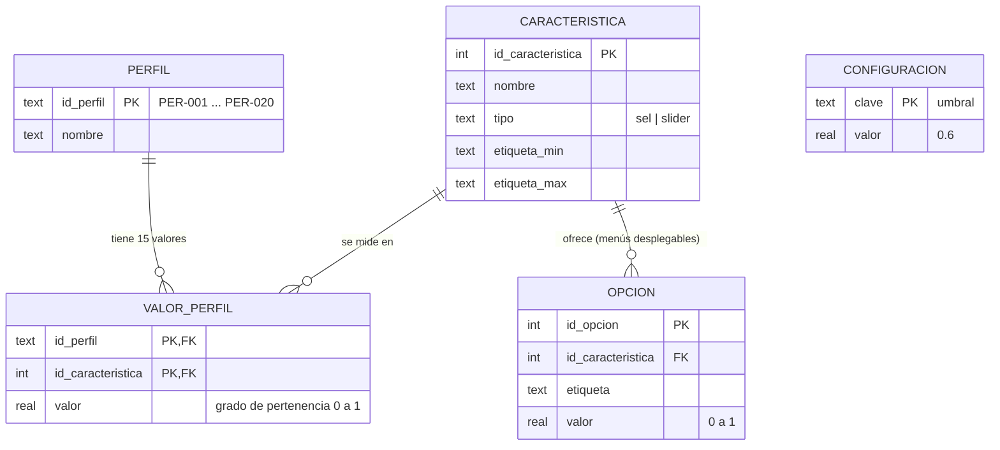

# Diagrama de relaciones de la base de datos (amistad.db, SQLite)

```mermaid
erDiagram
    PERFIL ||--o{ VALOR_PERFIL : "tiene 15 valores"
    CARACTERISTICA ||--o{ VALOR_PERFIL : "se mide en"
    CARACTERISTICA ||--o{ OPCION : "ofrece (menús desplegables)"
    PERFIL { text id_perfil PK "PER-001 ... PER-020"
             text nombre }
    CARACTERISTICA { int id_caracteristica PK
             text nombre
             text tipo "sel | slider"
             text etiqueta_min
             text etiqueta_max }
    OPCION { int id_opcion PK
             int id_caracteristica FK
             text etiqueta
             real valor "0 a 1" }
    VALOR_PERFIL { text id_perfil PK,FK
             int id_caracteristica PK,FK
             real valor "grado de pertenencia 0 a 1" }
    CONFIGURACION { text clave PK "umbral"
             real valor "0.6" }
```
